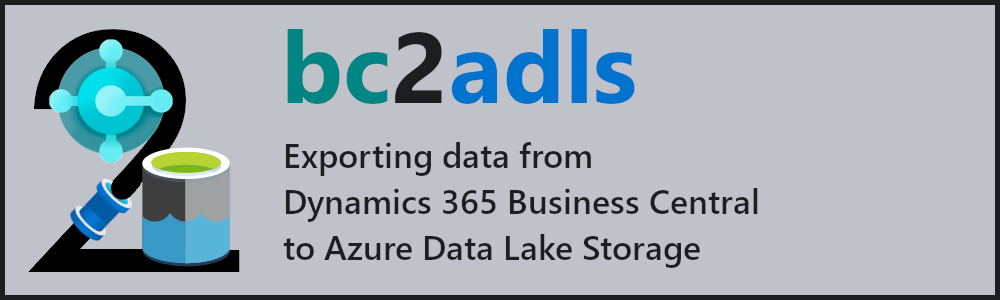

# Project

> **This tool is an <u>experiment</u> on Dynamics 365 Business Central with the sole purpose of discovering the possibilities of having data exported to an Azure Data Lake. To see the details of how this tool is supported, please visit [the Support page](./SUPPORT.md). In case you wish to use this tool for your next project and engage with us, you are welcome to write to bc2adls@microsoft.com. As we are a small team, please expect delays in getting back to you.**

## Introduction

The **bc2adls** tool is used to export data from [Dynamics 365 Business Central](https://dynamics.microsoft.com/en-us/business-central/overview/) (BC) to [Azure Data Lake Storage](https://docs.microsoft.com/en-us/azure/storage/blobs/data-lake-storage-introduction) and expose it in the [CDM folder](https://docs.microsoft.com/en-us/common-data-model/data-lake) format. The components involved are the following,
- the **[businessCentral](/tree/main/businessCentral/)** folder holds a [BC extension](https://docs.microsoft.com/en-gb/dynamics365/business-central/ui-extensions) called `Azure Data Lake Storage Export` (ADLSE) which enables export of incremental data updates to a container on the data lake. The increments are stored in the CDM folder format described by the `deltas.cdm.manifest.json manifest`.
- the **[synapse](/tree/main/synapse/)** folder holds the templates needed to create an [Azure Synapse](https://azure.microsoft.com/en-gb/services/synapse-analytics/) pipeline that consolidates the increments into a final `data` CDM folder.

The following diagram illustrates the flow of data through a usage scenario- the main points being,
- Incremental update data from BC is moved to Azure Data Lake Storage through the ADLSE extension into the `deltas` folder.
- Triggering the Synapse pipeline(s) consolidates the increments into the data folder.
- The resulting data can be consumed by applications, such as Power BI, in the following ways:
	- CDM: via the `data.cdm.manifest.json manifest`
	- CSV/Parquet: via the underlying files for each individual entity inside the `data` folder
	- Spark/SQL: via [shared metadata tables](/.assets/SharedMetadataTables.md)
	

More details:
- [Installation and configuration](/.assets/Setup.md)
- [Executing the export and pipeline](/.assets/Execution.md)
- [Creating shared metadata tables](/.assets/SharedMetadataTables.md)
- [Frequently asked questions](/.assets/FAQs.md)
- Webinars
    - [[Jan 2022] Webinar introducing bc2adls](https://www.microsoft.com/en-us/videoplayer/embed/RWSHHG)
    - [[Mar 2023] Enhancements to bc2adls - CloudChampion](https://www.cloudchampion.dk/c/dynamics-365-business-central-azure-data-lake/)

## Changelog

This project is constantly receiving new features and fixes. Find a list of all major updates in the [changelog](/.assets/Changelog.md).

## Testimonials

Here are a few examples of what our users are saying ...

> “After careful consideration we, as Magnus Digital, advised VolkerWessels Telecom, a large Dutch telecom company, to use and exploit the features of BC2ADLS. We see BC2ADLS currently as the only viable way to export data from Business Central to Azure Data Lake at large scale and over multiple administrations within BC. By the good help of Soumya and Henri, we were able to build a modern data warehouse in Azure Synapse with a happy customer as result.” 

&mdash; Bas Bonekamp, [Magnus Digital](https://www.magnus.nl/)   

> “With the bc2adls we have found a way to export huge amount of data from Business Central to a data warehouse solution. This helps us allot to unburden big customers to move to Business Central Online. Also it is easy to use for our customers so they can define their own set of tables and fields and schedule the exports.”

&mdash; Bert Verbeek, [4PS](https://www.4ps.nl/)  

> “I can't believe how simple and powerful loading data from  Business Central is now. It's like night and day—I'm loving it!”

&mdash; Mathias Halkjær Petersen, [Fellowmind](https://www.fellowmindcompany.com/)  

> “At Kapacity we have utilized the bc2adls tool at several customer projects. These customer cases span from small a project with data extract from 1-3 companies in Dynamics Business Central SaaS (BC) to an enterprise solution with data extract from 150 companies in BC. bc2adls exports multicompany data from BC til Azure Data Lake Storage effectively with incremental updates. The bc2adls extension for BC is easy to configure and maintain. The customer can add new entities (tables and fields) to an existing configuration and even extend the data extract to include new company setup. We have transformed data with the Azure Synapse pipelines using the preconfigured templates from the bc2adls team. The data analyst queries this solution in Power BI using the Shared Metadata db on Serverless SQL. In the enterprise project we did the data transformation using Azure Databricks. Thanks to the bc2adls team providing these tools and great support enabling us to incorporate this tool in our data platform.”

&mdash; Jens Ole Taisbak, [TwoDay Kapacity](https://www.kapacity.com/)  

> “We have had great success using the BC2ADL tool. It is well thought out and straightforward to implement and configure. The Microsoft team that develops the tool continues to add new features and functionality that has made it a great asset to our clients. We looked to the BC2ADL tool to solve a performance issue in reporting for Business Central. Using the BC2ADL tool along with Synapse Serverless SQL we have been able to remove the primary reporting load from the BC transactional database, which has helped alleviate a bottleneck in the environment. When the BC2ADL tool was updated to export from the replicated BC database we were able to really take full advantage of the process and provide intraday updates of the Azure Data Lake with no noticeable affect on BC performance. The Microsoft team has been extremely helpful and responsive to requests from the community on feature requests and support.”

&mdash; Tom Link, [Stoneridge Software](https://stoneridgesoftware.com/)  

## Contributing

This project welcomes contributions and suggestions.  Most contributions require you to agree to a
Contributor License Agreement (CLA) declaring that you have the right to, and actually do, grant us
the rights to use your contribution. For details, visit https://cla.opensource.microsoft.com.

When you submit a pull request, a CLA bot will automatically determine whether you need to provide
a CLA and decorate the PR appropriately (e.g., status check, comment). Simply follow the instructions
provided by the bot. You will only need to do this once across all repos using our CLA.

This project has adopted the [Microsoft Open Source Code of Conduct](https://opensource.microsoft.com/codeofconduct/).
For more information see the [Code of Conduct FAQ](https://opensource.microsoft.com/codeofconduct/faq/) or
contact [opencode@microsoft.com](mailto:opencode@microsoft.com) with any additional questions or comments.

## Trademarks

This project may contain trademarks or logos for projects, products, or services. Authorized use of Microsoft 
trademarks or logos is subject to and must follow 
[Microsoft's Trademark & Brand Guidelines](https://www.microsoft.com/en-us/legal/intellectualproperty/trademarks/usage/general).
Use of Microsoft trademarks or logos in modified versions of this project must not cause confusion or imply Microsoft sponsorship.
Any use of third-party trademarks or logos are subject to those third-party's policies.
